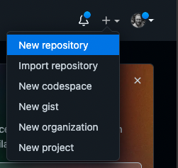
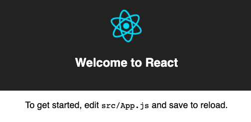
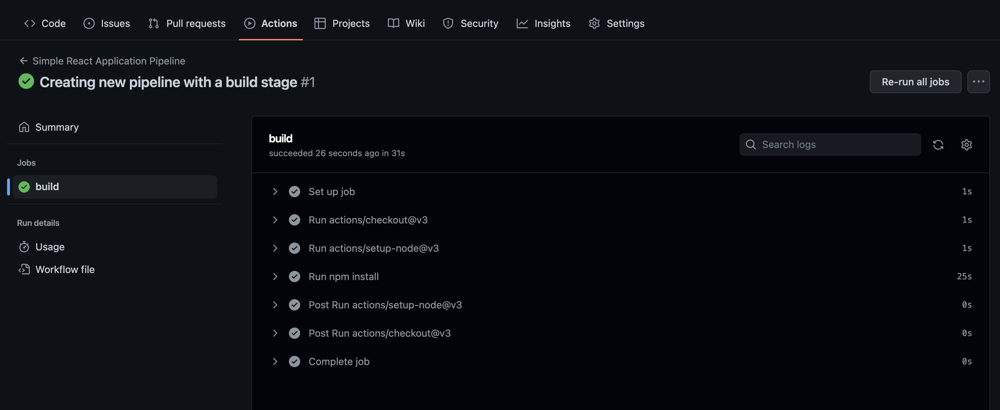
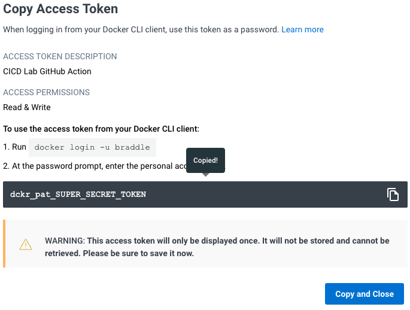
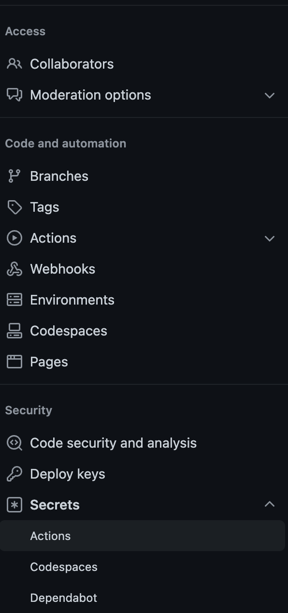
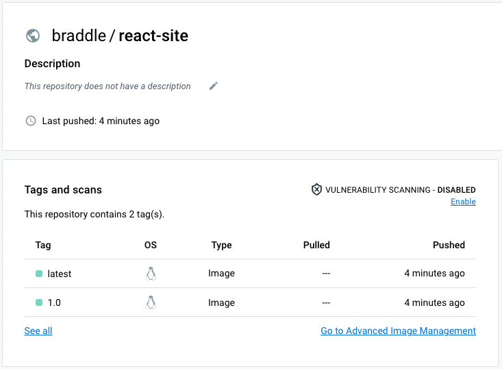

# GitHub Actions Pipeline

## Prerequisites
   
1. Install [Docker](https://docs.docker.com/desktop/install/mac-install/)
2. Create an account on [Docker Hub](https://hub.docker.com/signup) _Just a free account_
3. Login on Docker Desktop to your Docker Hub account

## Activity

We are going to create a [GitHub actions](https://github.com/features/actions) pipeline that compiles, tests and pushes 
our application to dockerhub.

You can see an example repository of this activity [here](https://github.com/braddle/cicd-lab).

### Create a new GitHub repository

Locate the `+` button to create new things at the top right of the screen and click `New Repository`



Create a new empty repository call `cicd-lab` (**Do not** add a README, Licence or gitignore)


Create a new directory outside this project and copy the content of the `app` directory into it.

check the application works

  - `npm install`
  - `npm test`
  - `docker build . -t cicdnode`
  - `docker run -p 3000:3000 cicdnode`

if you visit [localhost:3000](http://localhost:3000) you should see the following web page



Get this code into your new repository using the follwing command line commands
  - `git init`
  - `git add .`
  - `git commit -m "Adding default application code to repo"`
  - `git branch -M main`
  - `git remote add origin git@github.com:{YOUR GITHUB USERNAME}/cicd-lab.git`
  - `git push -u origin main`

If all of this is successful you repository on GitHub should now look something like this


### Creating a First (Test) Stage in the Pipeline

We are now going to create the first part of our Pipeline. This will react to any changes to a branch a run the 
test for our application

#### Define the Pipeline

At the top level of your repository create a file `.github/workflows/test.yml` and paste the following content into it

```yaml
name: Test Stage for a Simple React Application Pipeline

on:
   push:
      branches:
         - "*"

jobs:
   test:
      runs-on: ubuntu-latest
      steps:
         - uses: actions/checkout@v3
         - uses: actions/setup-node@v3
           with:
              node-version: 16
         - run: npm install
         - run: npm test
```

##### What does it Mean?

**name** - The name of the Workflow/Stage to be displayed to users

**on** - This defines when the Workflow should run. In this case it is configured to run when ever someone pushes to any 
branch. You can read more about the different trigger options [here](https://docs.github.com/en/actions/using-workflows/triggering-a-workflow)

**jobs** - The work flow is broken down to different Jobs. This workflow only has one called `test`

**runs-on** - Allows you to choose the environment that the job will run on. you can choose from a number of different 
runners from GitHub or host your own runners. We are using the latest version of Ubuntu. You can read more about the 
different runners [here](https://docs.github.com/en/actions/using-jobs/choosing-the-runner-for-a-job#choosing-github-hosted-runners)

**steps** - The jobs are broken down into steps these run synchronously in the order they are defined in.

**uses** - The uses steps pull in a predefined step that we can use rather than havin to recreate them from scratch 
ourselves.

We are using `actions/checkout` at version `v3` to check out the code from the repository that we are running the 
pipeline on. The other predefined step we are using is `actions/setup-node@v3` this installs our runner with node and we
have defined it should install version `16`

**run** - these steps you to execute the shell command given. in our workflow we are running `npm install` & `npm test`. 

Commit & Push the new YAML file
   - `git add .`
   - `git commit -m "Creating new pipeline with a test stage"`
   - `git push origin main`

#### Watch the Pipeline run

Go to the `Actions` tab on your GitHub repository


From here you should be able to see that your action is now running


If you click on the running action you should be able to see the details of the run.



### Creating the Second (Build/Push) Stage in the Pipeline

Now that we know if our test pass or fail we will create a stage the build a containerized version of our application
and pushes it to Docker Hub

Login to docker hub and [create](https://hub.docker.com/repository/create) a new public repository call `react-site`


once the repository is set up you will also need to create a new 
[Access Token](https://hub.docker.com/settings/security?generateToken=true) we will use this to allow GitHub action to 
talk to Docker Hub. Give it a description of where it will be used something like `CICD Lab GitHub Action` so that you 
will know what the token is for and when it can be deleted. Give the token access permission for `Read & Write`.


Once the token is created copy it and keep it safe. You will not be able to retrieve this token you can only create a new
token.



Next we need to create secrets within our `cicd-lab` repository that can be used by our Build stage to log in to Docker Hub 
within our action. 

Within the setting tab of your `cicd-lab` repository 


use the right hand menu to go to the Secrects for Actions page



to create 2 repository secrets

  - `DOCKER_USERNAME` _The username you use to log in to Docker Hub_
  - `DOCKER_TOKEN` _The access token you just created in docker hub_

Once the secrets have been created in GitHub you will not be able to view them again. You can set new values for the 
secret or delete them. 


Create a new workflow `.github/workflows/build.yml` and paste the following content to the end of the file

```yaml
name: Building and Pushing container of a small React JS Application

on:
   push:
      tags:
         - "*.*"

jobs:
   push:
      runs-on: ubuntu-latest
      steps:
         - uses: actions/checkout@v3
         - name: Log in to Docker Hub
           uses: docker/login-action@v2
           with:
              username: ${{ secrets.DOCKER_USERNAME }}
              password: ${{ secrets.DOCKER_TOKEN }}

         - name: Extract metadata (tags, labels) for Docker
           id: meta
           uses: docker/metadata-action@v4
           with:
              images: { YOUR_DOCKER_HUB_USERNAME_HERE }/react-site

         - name: Build and push Docker image
           uses: docker/build-push-action@v3
           with:
              context: .
              push: true
              tags: ${{ steps.meta.outputs.tags }}
              labels: ${{ steps.meta.outputs.labels }}
```

**NOTE** Don't forget to set _your_ Docker Hub username on line 23 (`images:`) of the YAML file.

Commit & Push the new YAML file

1. `git add .`
2. `git commit -m "Creating new pipeline with a build/push stage"`
3. `git push origin main`

Pushing these changes will only run the test stage and not the new build/push stage because the new stage only runs when
tags have been pushed to the repository


Know that we know that our application passes all of its test we can create a tag this will trigger that workflow that 
will containerise our application and push it to Docker Hub 

1. `git tag 1.0 -m "Creating the first build of our application"`
2. `git push --tags`

this will trigger the Build/Push stage to run. It should look something like this.


once the stage has completed you should find that the Repository you created on Docker hub should now contain containers 
`Latest` & `1.0` tags of the Application, which should look like this:


